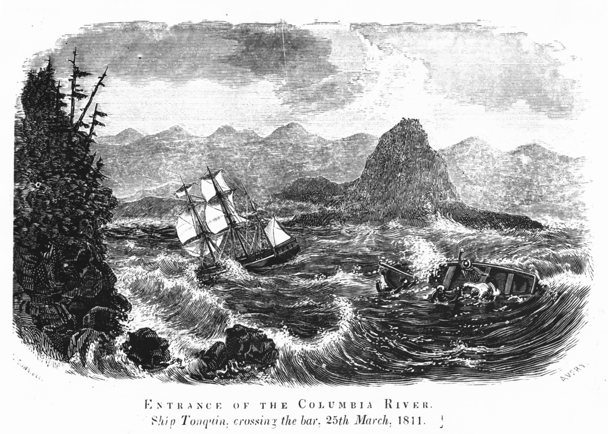

## Background

> Mr Ackland reports seeing two men on the bottom of a boat, lead colored bottom, nearing the breakers yesterday morning. He could do nothing to save the men, and **they bid him farewell by tipping their hats as they entered the jaws of death**. - (Daily Astorian, p 34)

> They saw the cruel wave rear its crested head, and drawing the now helpless man in with the undertow, it lifted him up and then broke over him. After this they saw him no more, and it is probable that this is the last of Louis C. Webber until **“the sea shall give up the dead that are in it.”** - [The Daily Astorian, May 30, 1880](https://www.offbeatoregon.com/1206d-most-dangerous-catch-salmon-on-columbia-river-bar.html)

## The Music

This section starts with the ebbtide, where the boats drift in harmony with the tide. The floodtide is when the disaster comes, fighting with the current with the breaker waves sweeping over the tiny fishing boats.

The trio is going to be subjected to tremendous forces, and their job is to weather the storm. The "storm" will be audio from a synthesizer and samplers driven by a generative sequence, which will provide "breaker waves" (detuning) that are surprise events (dissonances) that the quartet needs to react to. The detuning will move the tonal center around, disorienting the players.

The accordion acts like the boat puller, providing the rhythm of the ship.

The three voices of the quartet are fisherpeople lost in the storm - some boats will make it, and some do not. Each voice will have a motif, or a variation of a motif.