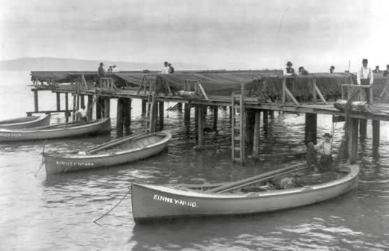
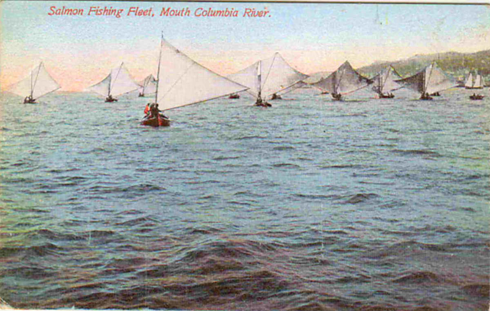

This website is about the piece *Astoria Requiem*, a commissioned piece for [Friends After Good Sound](https://www.friendsaftergoodsound.com/). We will share information, and video about this piece as it evolves.

Astoria Requiem will be performed live at Performance Works NW on September 12, 2026.

## Background

> A few weeks of warm weather sent the snows into the Columbia in torrents and the great river rushed down to the ocean, swollen and turbulent. Great tracts were inundated and the tides affected (p 41)

> To pull their heavy 24-foot boats against such a current was a feat few of them were capable of, and the only course open to the majority was to face death with fortitude. (Salmon Fever, River's End)

Astoria and the Columbia River Bar is a dangerous place, where two unstoppable forces meet and make for unpredictable weather and conditions. 

](img/cannery-boat2.webp)

In the late 19th century, many salmon canneries in Astoria needed fishermen to supply them. These fishermen (mostly in pairs) would go out in 24 foot boats, floating out to the ocean on the ebbtide, harvest the fish from the gill nets, catch fish, and float back into Astoria with the incoming flood tide. 

It was a dangerous profession, especially because of the lack of engines on the boat made the fishermen especially vulnerable to to the elements. 

In early May of 1880, a sudden gale caught many of these boats by surprise, and resulted in the death of over 25 fishermen.[^1] This piece is an attempt to memorialize the fishermen, and not forget them.

## Structure of the Piece

This piece is in 3 movements: 

- [Two Forces](two-forces.qmd), a short intro introducing the two forces of the Columbia River Bar
- [Ebbtide and Storm](ebbtide.qmd), featuring a storm using shoegazer elements.
- [Requiem](requiem.qmd), in memory of those lost at sea

## Land Acknowledgement

We recognize that the land of Astoria and the Lower Columbia was inhabited by tribes including the Chinook, Clatsop, Kathlamet, Wahkiakum, Multnomah, Cascades, Tualatin Kalapuya, Molalla, Wasco, Clackamas, Cowlitz, Skilloot and Atfalati have ancestral connections to the lower Columbia and continue to be stewards of the river. We recognize that tribal territories were often shared and overlapping, and that this may be an incomplete list of those who lived on these lands.

The Chinook and Clatsop tribes (with others) are working to be recognized as the Chinook Indian Nation. Learn more and donate at https://chinooknation.org/

[^1] Some sources (such as[Pacific Graveyard]()) say that over 200 fishermen perished in the storm, but an investigative article by the [Chinook Observer](https://chinookobserver.com/2018/03/29/this-nest-of-dangers-may-1880-how-legends-come-to-be/#google_vignette) suggests that the loss was not that large, nor does the editor of [Salmon Fever, River's Edge](https://amatobooks.com/products/salmon-fever-rivers-end-tragedies-on-the-lower-columbia-river-in-the-1870s-1880s-and-1890s-by-liisa-penner) agree with the larger number.